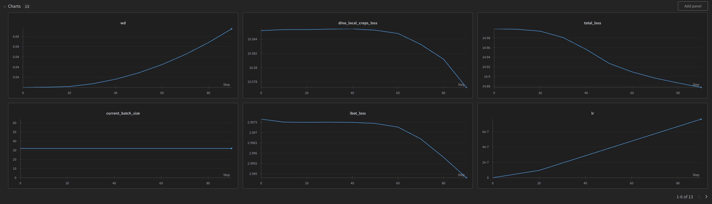
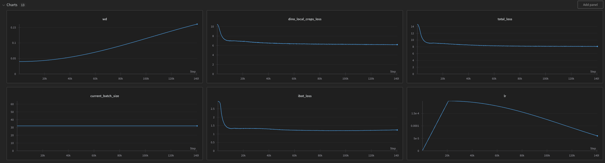

`python log_wandb.py --json_fpath sample_metrics.json`

Wandb output:

* note the run id to update for next time... - i believe even the json file name can be used as run_id. 
* Say run id is "rsiqopu2". 

Now to update the same experiment we run following code: 

`python log_wandb.py --json_fpath sample_metrics.json --id 'rsiqopu2'`

Wandb output:
